# Hur man fixar babel 

### sammanfattning 

###### här kommer du får reda man fixar babel till din dator så att du kommer kunna använda dentill dina projekt. 

### Steg 1

Det första man ska göra innan man kan börja med någ som angår babel. Så måste man kolla på sin dator om man har ett sak som heter "Node" och det gör du genom att du öpnar "cmd" på din dator och så skirver man "node -v" och sen trycker enter.

När man har gjort det så kan det antingen stå att man har en verition och då ser det ut så här.

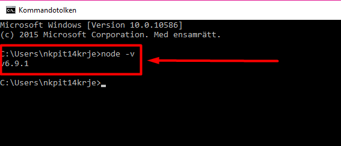

Om du inte har det så kommer det stå att du inte har det men det kan du ladda ner [här.](https://nodejs.org/en/)

När du har det så kan vi nu gå vidare. 

### Steg 2

Nu har vi node så det vi kan göra nu är att vi lägga in våran babel där vi vill ha den för att babel kan man användad sig av en model som är global och en annan som är lokalt. Jag ska visa dig den lokala för då är det att den veritionen av babel du använder till det projektet så när du skickar den till en annan så får de samma verition så att det inte kanske koden går sönder. 

Så börja att skapa ett projekt. 

När du har skapat din projekt mapp så klickar du här uppe.
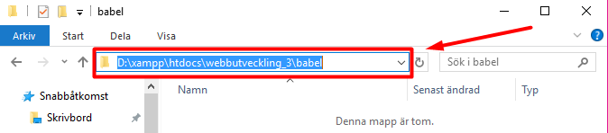

Och så skriver du cmd där och så trcker du på enter.
### Steg 3

Då får du ett cmd så att du redan är i den mappen som du är i som är ditt projekt.

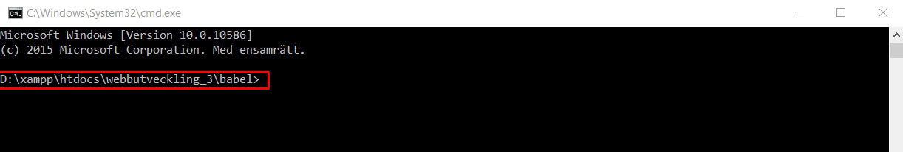

När du är här så ska vi skriva in ett komando så att du får ner en fil som heter "package.json". Komandot är "$ npm init" (vissa komand prompter använder sig av att $ och om det inte finkar så antingen lägga tecknet eller ta bort den). Efter att tyckt enter så får man detta 

Nu håller filen på att skapas men vi måste göra lite saker så vet vad det ska stå i filen så nu säger den att den kommer att ligga i filen babel så slår vi enter igen.

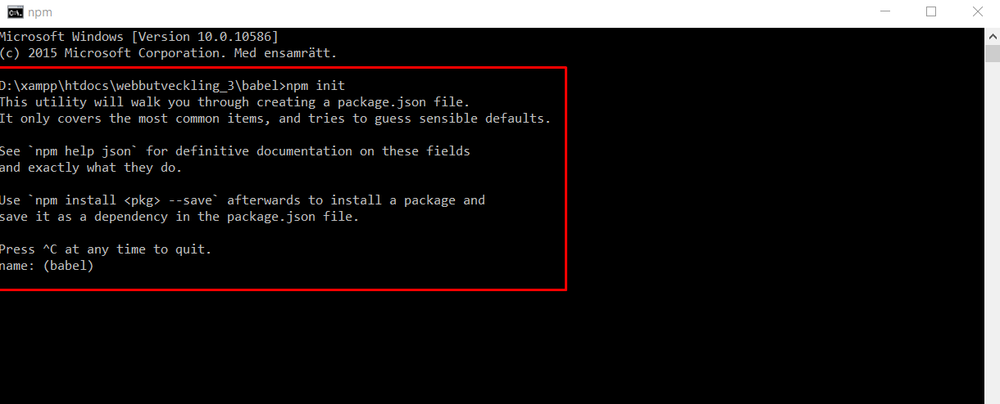

### Steg 4
Nu får vi veta att den kommer vara på version (1.0.0) detta kan man ändra men det ska vi inte gör vi fortsätter men att trycka enter.

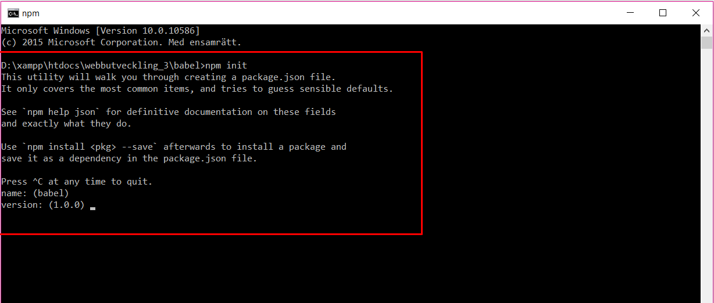

Här kan man skriva en beskrivning om man vill men jag tänkte bara skriva "xxxx" så ni får se hur det ser ut den i filen sen är det bara trycka enter.

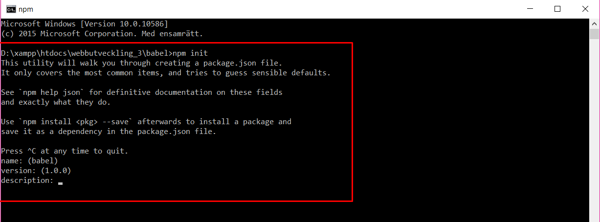

Då kommer ni hit och detta behöver vi inte bry oss om för detta är om du ska hämnta olika packet. (tryck enter)

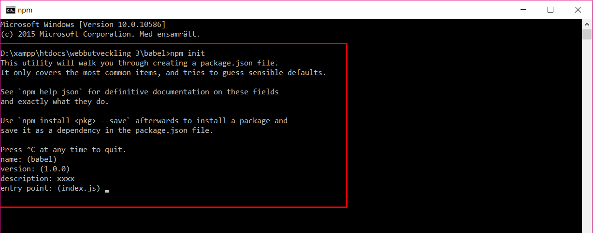

Då får upp några saker det är bara trcka enter tills du kommer till "author:" där kan du skriva ditt namn. Efter det så får du en där det står "license:" och så står det redan en om det den kan man använda men om amn har en annan licens så kan man byta.(tryck enter)

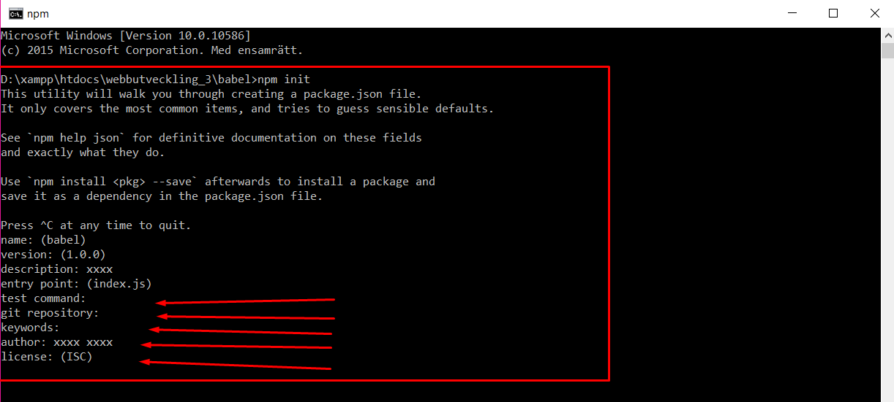

Nu är vi nästan klara nu frågar den bara om man tycker att allt stämmer och det gör vi så vi trycker enter.

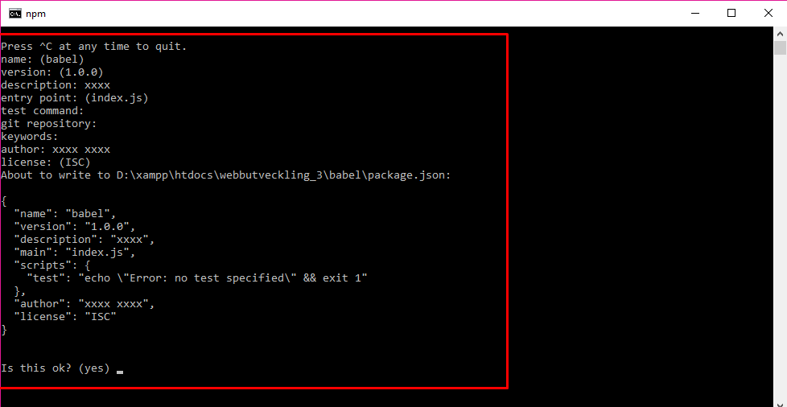

Nu har vi fått vår "package.json" fil.
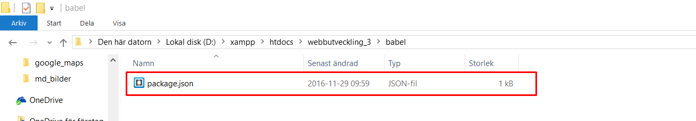

### Steg 5

Nu ska tillbaka till cmd om skriva in ett till komando som är "$ npm install --save -dev babel-cli babel-preset-latest"  (babel-cli babel-preset-latest är ett tillägg som man behöver för att babel ska funka men det finns andra på [Babel.](https://babeljs.io/))

Det kommer att börja ladda och detta kan ta en  minut men när dett a är klar så ska du få en mapp vid din fil.

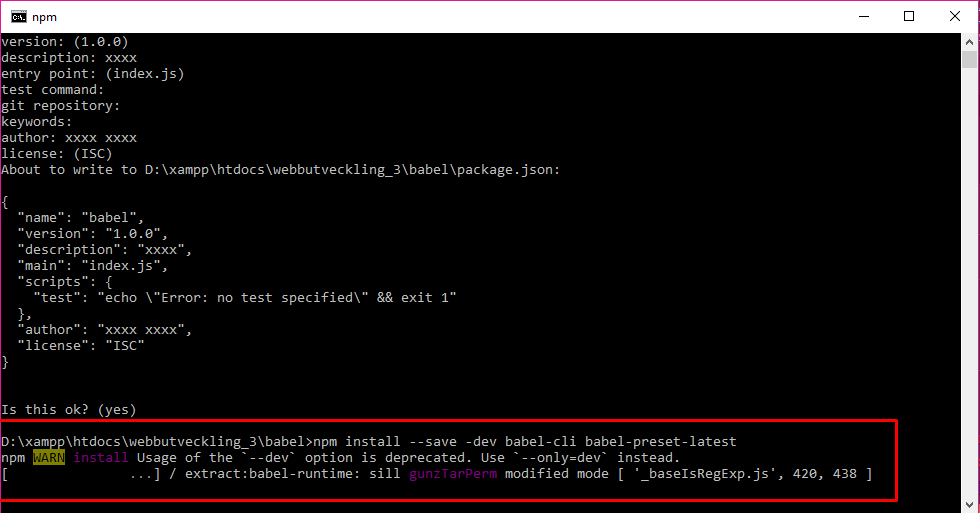

Mappen heter "node_modules".

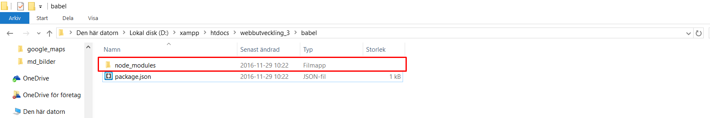

### Steg 6
Nu ska vi lägga till tvvå mappar i ppojektet som heter " src " och " lib "

Man kan döpa dom till vad man vill men ni kommer att förstå varför jag döper dom så här.

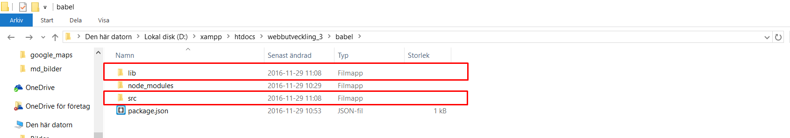

### Steg 7

Nu ska vi in i din "package.json" fil och i den fer den ut som följande.

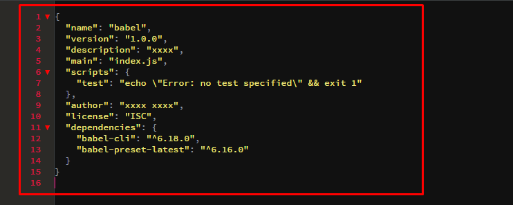

Vi ska ändra lite saker eller mer lägga till saker och ena saken är  ( "babel": {
    "presets": [ "latest"]
  },  ) Vad detta gör är att man ska kunna annvända tillägget som vi la in förut.
  
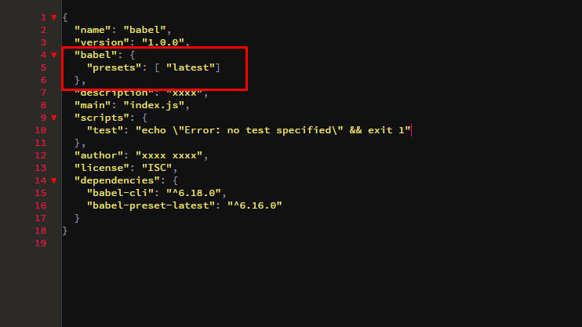

och det andra är att vi ska lägga till ( "build": "babel -w src -d lib" ) i "script"
OBS att du måste sätta ett "," efter ( "test": "echo \"Error: no test specified\" && exit 1" )

nu ska jag bryta de det vi nyss la till. 

" Build " är bara ett komando det kan vara vad du vill .

" babel " är för att den ska använda sig av babel..

" -w eller --watch " det gör att sen när du använder dett så uppdaterar den din fil som du skriver i hela tiden när du uppdaterar den.

" src -d lib  "  betyder att den tar filen från mappen " src " och lägger den förändrade filen till " lib "(dom filerna du skriver es.6 ska ligga i src)

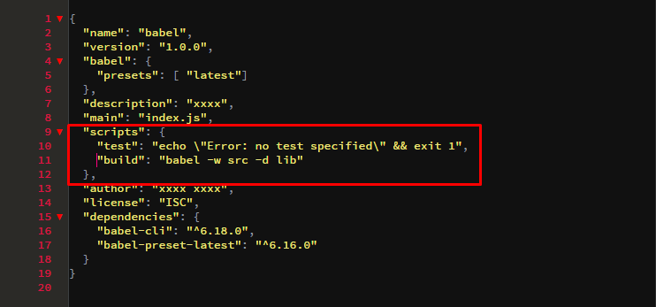

### Steg 8

Nu är nästan klar det ändra du sa göra nu är att varje gång du ska jobba i den så ska skall du öppna upp cmd så att du är i rätt projekt mapp och så skriver du in ett kommando som  är " npm run build " (OBS om du ändrande komandots namn (build) till något nannat så måste du skriva det).

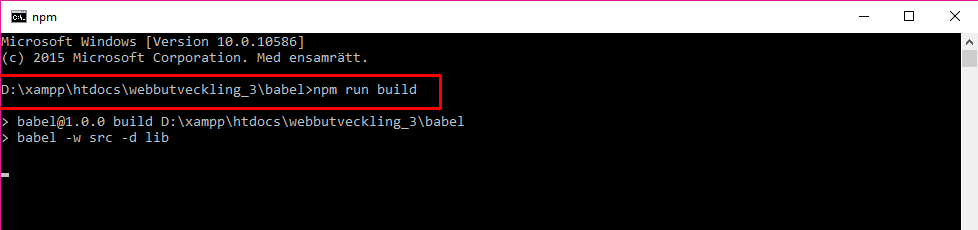

Efter du har tryckt enter så kommer det se ut så här och vad detta gör är att om du skapar en fil i src spara den så kommer den skickat ttll lib mappen ochc kommer att vara ändrad till en äldre modellav javascipt. Man kommer se när den uppdateras.

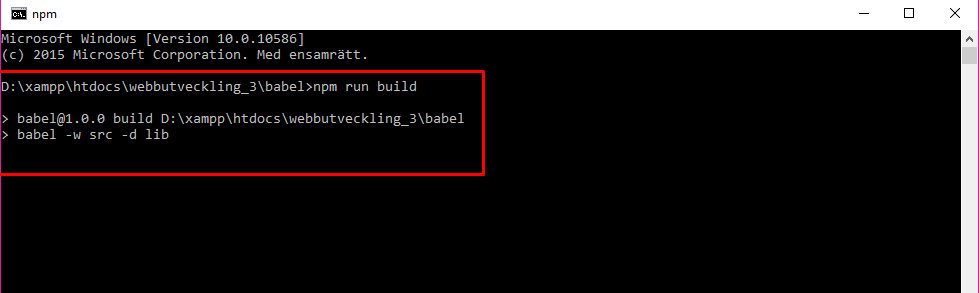