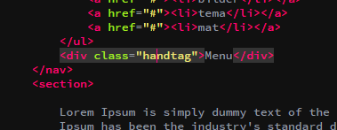
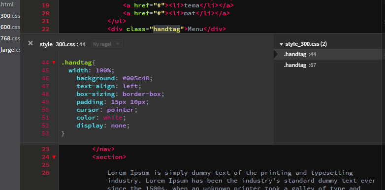
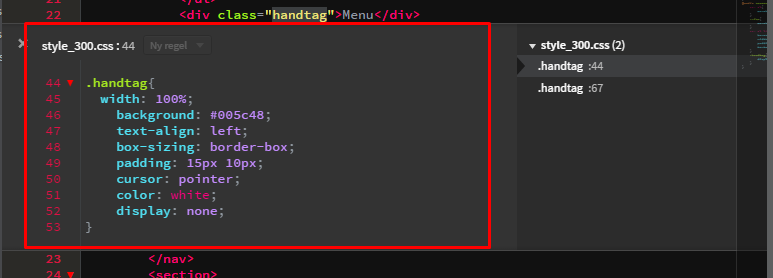
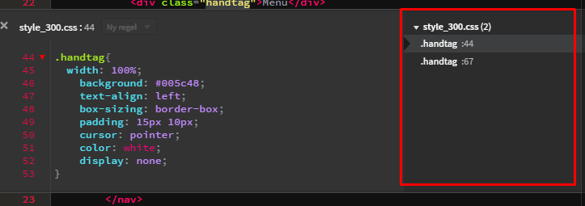
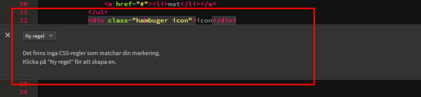
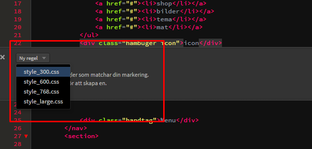
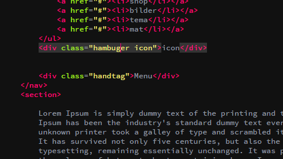

 # Quick edit tutorial
 ## sammanfattning 
   i denna tutotrial så ska vi gå  igenom ocgh kolla på hur en "quick edit" 
   fungerar och vad den är bra för.
   
   
 
 ###  1. steg ett 
För att detta ska funka så måste du ha brakets och om du inte har det så  kan du hämta det  på [brackets](http://brackets.io/ "brackets")

 
 ###  2. steg två 
 När du har en massa kod skriven både i html:n och i din css så kan man tycka att det är jobbit att hoppa mellan dom och det är det som är det bra med "Quick edit" det du gör är att du sätter markören på den taggen som du vill gå till css:n
 
 
 
 
 ###  3. steg tre  
 Om du klickar ctrl + E så får du upp "Quick  edit" då kommer du till detta.
 
 
 
 ###  4. steg fyra 
 Detta området är din css och den koden som du kan editera.
 
 
 
 ###  5. steg fem 
 Detta är var alla dina css filer ligger saamt var själva taggen om nu är handtag finns.
 
 ###  6. steg sex 
 Om det är så att det är i en ny class/id eller tagg som får man klicka på skapa en ny regel 
 
 ###  7. steg sju 
 Sedan får du välja css fil.
 
 ###  8. steg åtta 
 Och efter det så skapar den din css så det är bara börja att editera.
 
 ###  9. steg nio
 Och när du är klar så är det bara att trycka ctrl + E för att stänga "quick edit"
 
 
 ## OBS när du skapar ny regel som läggs den längs ner i din css fil. 
 
 made by Kristoffer Jealmo